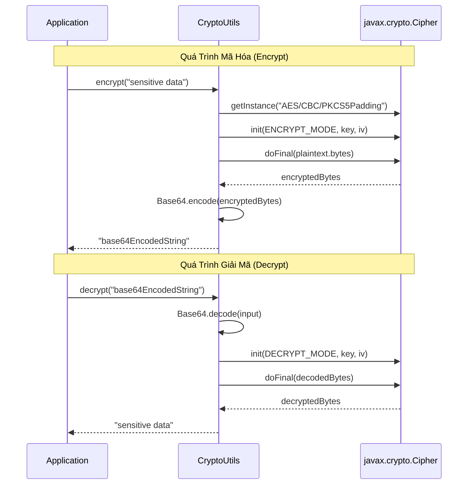
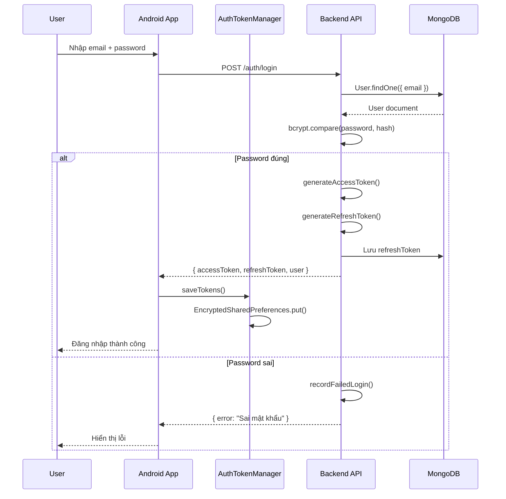
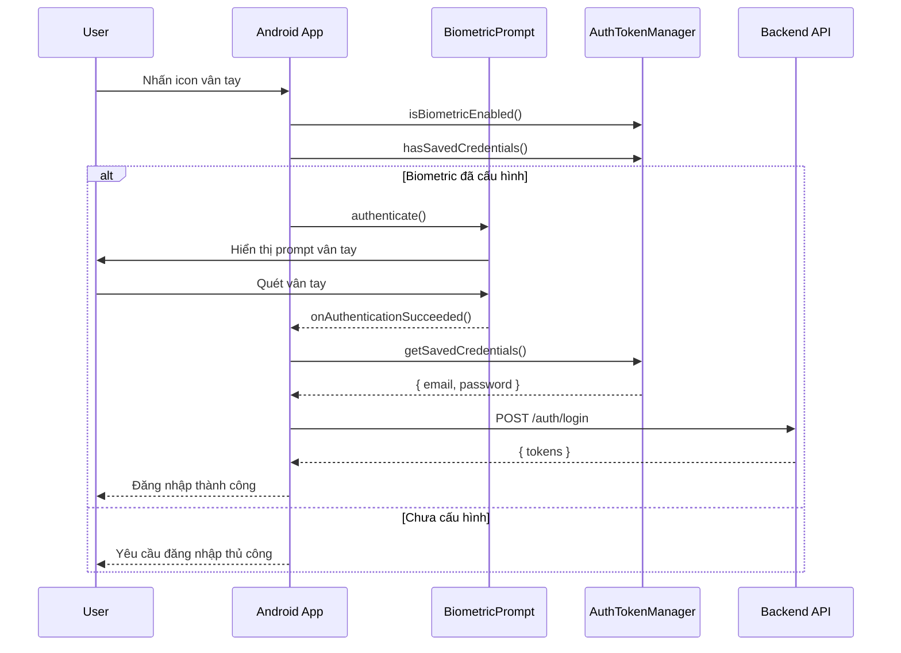

# 🔐 Tài Liệu Mã Hóa và Bảo Mật - Sakura Flashcard

## Mục Lục
1. [Tổng Quan Kiến Trúc Bảo Mật](#1-tổng-quan-kiến-trúc-bảo-mật)
2. [Mã Hóa Phía Client (Android)](#2-mã-hóa-phía-client-android)
3. [Mã Hóa Phía Server (Backend)](#3-mã-hóa-phía-server-backend)
4. [Bảo Mật Truyền Tải (Transport Security)](#4-bảo-mật-truyền-tải-transport-security)
5. [Cơ Chế Xác Thực](#5-cơ-chế-xác-thực)
6. [Bảo Vệ Chống Tấn Công](#6-bảo-vệ-chống-tấn-công)
7. [Sơ Đồ Luồng Dữ Liệu](#7-sơ-đồ-luồng-dữ-liệu)
8. [Khuyến Nghị Bảo Mật](#8-khuyến-nghị-bảo-mật)

---

## 1. Tổng Quan Kiến Trúc Bảo Mật

### 1.1. Mô Hình Bảo Mật Nhiều Lớp

Sakura Flashcard sử dụng mô hình **Defense in Depth** (Phòng thủ theo chiều sâu) với nhiều lớp bảo mật:

```
┌─────────────────────────────────────────────────────────────────────────────┐
│                           ANDROID CLIENT                                     │
├─────────────────────────────────────────────────────────────────────────────┤
│  ┌───────────────┐  ┌───────────────┐  ┌───────────────┐  ┌───────────────┐ │
│  │   AES-256     │  │ EncryptedSP   │  │  SQLCipher    │  │  Root/Debug   │ │
│  │   CryptoUtils │  │   AES-GCM     │  │   Database    │  │   Detection   │ │
│  └───────────────┘  └───────────────┘  └───────────────┘  └───────────────┘ │
│                                                                              │
│  ┌───────────────────────────────────────────────────────────────────────┐  │
│  │                    Certificate Pinning (TLS)                           │  │
│  └───────────────────────────────────────────────────────────────────────┘  │
└──────────────────────────────────┬──────────────────────────────────────────┘
                                   │ HTTPS/TLS 1.2+
                                   ▼
┌─────────────────────────────────────────────────────────────────────────────┐
│                           BACKEND (Node.js)                                  │
├─────────────────────────────────────────────────────────────────────────────┤
│  ┌───────────────┐  ┌───────────────┐  ┌───────────────┐  ┌───────────────┐ │
│  │    bcrypt     │  │     JWT       │  │ Rate Limiting │  │  XSS/NoSQL    │ │
│  │  Password Hash│  │    Tokens     │  │   Protection  │  │  Protection   │ │
│  └───────────────┘  └───────────────┘  └───────────────┘  └───────────────┘ │
│                                                                              │
│  ┌───────────────────────────────────────────────────────────────────────┐  │
│  │                      MongoDB (Data Encryption)                         │  │
│  └───────────────────────────────────────────────────────────────────────┘  │
└─────────────────────────────────────────────────────────────────────────────┘
```

### 1.2. Bảng Tóm Tắt Công Nghệ Mã Hóa

| Thành Phần | Công Nghệ | Thuật Toán | Mục Đích |
|------------|-----------|------------|----------|
| Data Encryption | CryptoUtils | AES-256-CBC | Mã hóa dữ liệu nhạy cảm |
| Token Storage | EncryptedSharedPreferences | AES-256-GCM/SIV | Lưu token an toàn |
| Database | SQLCipher | AES-256 | Mã hóa toàn bộ database |
| Password | bcryptjs | bcrypt (12 rounds) | Hash password phía server |
| Auth Tokens | jsonwebtoken | HS256 | JWT authentication |
| Key Management | Android Keystore | Hardware-backed | Bảo vệ master key |

---

## 2. Mã Hóa Phía Client (Android)

### 2.1. CryptoUtils - Mã Hóa Dữ Liệu AES

**File:** `app/src/main/java/com/example/sakura_flashcard/util/CryptoUtils.kt`

#### Thông Số Kỹ Thuật

| Thuộc Tính | Giá Trị |
|------------|---------|
| **Thuật Toán** | AES/CBC/PKCS5Padding |
| **Độ Dài Key** | 256 bits (32 bytes) |
| **Độ Dài IV** | 128 bits (16 bytes) |
| **Encoding Output** | Base64 |

#### Mã Nguồn Chi Tiết

```kotlin
package com.example.sakura_flashcard.util

import android.util.Base64
import javax.crypto.Cipher
import javax.crypto.spec.IvParameterSpec
import javax.crypto.spec.SecretKeySpec

object CryptoUtils {
    // Thuật toán: AES với chế độ CBC và padding PKCS5
    private const val ALGORITHM = "AES/CBC/PKCS5Padding"
    
    // Key 32 bytes cho AES-256
    // ⚠️ CẢNH BÁO: Trong production, key này phải được lưu trong Android Keystore
    private val SECRET_KEY = "sakura_flashcard_secret_key_2025".toByteArray()
    
    // Initialization Vector 16 bytes
    private val IV = "sakura_iv_vector".toByteArray()

    /**
     * Mã hóa chuỗi plaintext thành chuỗi Base64
     */
    fun encrypt(plainText: String): String {
        val cipher = Cipher.getInstance(ALGORITHM)
        val keySpec = SecretKeySpec(SECRET_KEY, "AES")
        val ivSpec = IvParameterSpec(IV)
        cipher.init(Cipher.ENCRYPT_MODE, keySpec, ivSpec)
        val encryptedBytes = cipher.doFinal(plainText.toByteArray(Charsets.UTF_8))
        return Base64.encodeToString(encryptedBytes, Base64.NO_WRAP)
    }

    /**
     * Giải mã chuỗi Base64 thành plaintext
     */
    fun decrypt(encryptedText: String): String {
        val cipher = Cipher.getInstance(ALGORITHM)
        val keySpec = SecretKeySpec(SECRET_KEY, "AES")
        val ivSpec = IvParameterSpec(IV)
        cipher.init(Cipher.DECRYPT_MODE, keySpec, ivSpec)
        val decodedBytes = Base64.decode(encryptedText, Base64.DEFAULT)
        val decryptedBytes = cipher.doFinal(decodedBytes)
        return String(decryptedBytes, Charsets.UTF_8)
    }
}
```

#### Sơ Đồ Quá Trình Mã Hóa



---

### 2.2. AuthTokenManager - Lưu Trữ Token An Toàn

**File:** `app/src/main/java/com/example/sakura_flashcard/data/auth/AuthTokenManager.kt`

#### Thông Số Kỹ Thuật

| Thuộc Tính | Giá Trị |
|------------|---------|
| **Library** | AndroidX Security Crypto |
| **MasterKey Scheme** | AES256_GCM |
| **Key Encryption** | AES256_SIV |
| **Value Encryption** | AES256_GCM |

#### Cơ Chế Hoạt Động

```kotlin
// Tạo MasterKey sử dụng Android Keystore
private val masterKey = MasterKey.Builder(context)
    .setKeyScheme(MasterKey.KeyScheme.AES256_GCM)
    .build()

// Tạo EncryptedSharedPreferences
private val encryptedPrefs: SharedPreferences = EncryptedSharedPreferences.create(
    context,
    "auth_prefs",                                              // Tên file
    masterKey,                                                  // MasterKey
    EncryptedSharedPreferences.PrefKeyEncryptionScheme.AES256_SIV,   // Mã hóa key
    EncryptedSharedPreferences.PrefValueEncryptionScheme.AES256_GCM  // Mã hóa value
)
```

#### Dữ Liệu Được Bảo Vệ

| Key | Mô Tả | Loại |
|-----|-------|------|
| `access_token` | JWT Access Token | String |
| `refresh_token` | JWT Refresh Token | String |
| `token_expiry` | Thời gian hết hạn token | Long |
| `user_id` | ID người dùng | String |
| `session_expiry` | Thời gian hết hạn session | Long |
| `last_activity` | Thời gian hoạt động cuối | Long |
| `biometric_enabled` | Bật/tắt đăng nhập vân tay | Boolean |
| `saved_email` | Email đã lưu (cho biometric) | String |
| `saved_password` | Password đã lưu (cho biometric) | String |

#### Sơ Đồ Kiến Trúc EncryptedSharedPreferences

```
┌─────────────────────────────────────────────────────────────────┐
│                    EncryptedSharedPreferences                    │
├─────────────────────────────────────────────────────────────────┤
│                                                                  │
│   ┌───────────────────────────────────────────────────────┐     │
│   │                   Android Keystore                     │     │
│   │   ┌───────────────────────────────────────────────┐   │     │
│   │   │           MasterKey (AES-256-GCM)              │   │     │
│   │   │      (Hardware-backed on supported devices)    │   │     │
│   │   └───────────────────────────────────────────────┘   │     │
│   └───────────────────────────────────────────────────────┘     │
│                              │                                   │
│                              ▼                                   │
│   ┌───────────────────────────────────────────────────────┐     │
│   │              Derived Keys (từ MasterKey)               │     │
│   │   ┌─────────────────┐   ┌─────────────────────────┐   │     │
│   │   │ Key Encryption  │   │    Value Encryption     │   │     │
│   │   │   (AES256_SIV)  │   │     (AES256_GCM)        │   │     │
│   │   └─────────────────┘   └─────────────────────────┘   │     │
│   └───────────────────────────────────────────────────────┘     │
│                              │                                   │
│                              ▼                                   │
│   ┌───────────────────────────────────────────────────────┐     │
│   │                 auth_prefs.xml (Encrypted)             │     │
│   │     Key: Encrypted("access_token")                     │     │
│   │     Value: Encrypted("eyJhbGciOiJIUzI1NiIs...")       │     │
│   └───────────────────────────────────────────────────────┘     │
│                                                                  │
└─────────────────────────────────────────────────────────────────┘
```

---

### 2.3. DatabaseSecurityManager - Bảo Mật Database

**File:** `app/src/main/java/com/example/sakura_flashcard/util/DatabaseSecurityManager.kt`

#### Chức Năng Chính

1. **Tạo và quản lý Database Passphrase**
2. **Root Detection** - Phát hiện thiết bị đã root
3. **Emulator Detection** - Phát hiện môi trường giả lập
4. **Debug Detection** - Phát hiện đang bị debug

#### Tạo Passphrase An Toàn

```kotlin
/**
 * Tạo passphrase ngẫu nhiên an toàn bằng SecureRandom
 */
private fun generateSecurePassphrase(): ByteArray {
    val random = SecureRandom()
    val passphrase = ByteArray(PASSPHRASE_LENGTH)  // 32 bytes
    random.nextBytes(passphrase)
    // Chuyển sang Base64 để lưu trữ
    return android.util.Base64.encode(passphrase, android.util.Base64.NO_WRAP)
}

/**
 * Lấy hoặc tạo mới passphrase cho database
 */
fun getDatabasePassphrase(): ByteArray {
    val storedPassphrase = encryptedPrefs.getString(PASSPHRASE_KEY, null)
    
    return if (storedPassphrase != null) {
        storedPassphrase.toByteArray(Charsets.UTF_8)
    } else {
        val newPassphrase = generateSecurePassphrase()
        encryptedPrefs.edit()
            .putString(PASSPHRASE_KEY, String(newPassphrase, Charsets.UTF_8))
            .apply()
        newPassphrase
    }
}
```

#### Cơ Chế Root Detection

```kotlin
fun isDeviceRooted(): Boolean {
    return checkRootBinaries() || checkSuProcess() || checkRootManagementApps()
}

private fun checkRootBinaries(): Boolean {
    val paths = arrayOf(
        "/system/bin/su",
        "/system/xbin/su",
        "/sbin/su",
        "/data/local/xbin/su",
        "/data/local/bin/su",
        "/data/local/su",
        "/system/sd/xbin/su",
        "/system/bin/failsafe/su",
        "/system/app/Superuser.apk"
    )
    return paths.any { File(it).exists() }
}

private fun checkSuProcess(): Boolean {
    return try {
        val process = Runtime.getRuntime().exec(arrayOf("which", "su"))
        val result = process.inputStream.bufferedReader().readText()
        process.destroy()
        result.isNotEmpty()
    } catch (e: Exception) {
        false
    }
}

private fun checkRootManagementApps(): Boolean {
    val rootApps = listOf(
        "com.noshufou.android.su",
        "com.thirdparty.superuser",
        "eu.chainfire.supersu",
        "com.koushikdutta.superuser",
        "com.topjohnwu.magisk"
    )
    val pm = context.packageManager
    return rootApps.any { packageName ->
        try {
            pm.getPackageInfo(packageName, 0)
            true
        } catch (e: Exception) {
            false
        }
    }
}
```

#### Kiểm Tra Bảo Mật Toàn Diện

```kotlin
data class SecurityStatus(
    val isRooted: Boolean,
    val isEmulator: Boolean,
    val isDebugged: Boolean
) {
    val isSecure: Boolean
        get() = !isRooted && !isDebugged
    
    val warningMessage: String?
        get() = when {
            isRooted -> "Thiết bị đã root, dữ liệu có thể không an toàn."
            isDebugged -> "Ứng dụng đang bị debug."
            else -> null
        }
}

fun performSecurityChecks(): SecurityStatus {
    return SecurityStatus(
        isRooted = isDeviceRooted(),
        isEmulator = isRunningOnEmulator(),
        isDebugged = isBeingDebugged()
    )
}
```

---

### 2.4. SQLCipher - Mã Hóa Database

**File:** `app/src/main/java/com/example/sakura_flashcard/di/OfflineModule.kt`

#### Cấu Hình Dependencies

```kotlin
// app/build.gradle.kts
dependencies {
    // SQLCipher for encrypted database
    implementation("net.zetetic:android-database-sqlcipher:4.5.4")
    implementation("androidx.sqlite:sqlite-ktx:2.4.0")
}
```

#### Khởi Tạo Database Mã Hóa

```kotlin
@Provides
@Singleton
fun provideFlashcardDatabase(
    @ApplicationContext context: Context,
    securityManager: DatabaseSecurityManager
): FlashcardDatabase {
    // Lấy passphrase từ DatabaseSecurityManager
    val passphrase = securityManager.getDatabasePassphrase()
    
    // Tạo SupportFactory với passphrase
    val factory = SupportFactory(passphrase)
    
    return Room.databaseBuilder(
        context,
        FlashcardDatabase::class.java,
        FlashcardDatabase.DATABASE_NAME
    )
    .openHelperFactory(factory)  // Sử dụng SQLCipher
    .fallbackToDestructiveMigration()
    .build()
}
```

#### Sơ Đồ Quá Trình Mã Hóa Database

```
┌─────────────────────────────────────────────────────────────────┐
│                      SQLCipher Encryption                        │
├─────────────────────────────────────────────────────────────────┤
│                                                                  │
│   1. Khởi tạo                                                    │
│   ┌───────────────────────────────────────────────────────┐     │
│   │ DatabaseSecurityManager.getDatabasePassphrase()        │     │
│   │  └─► SecureRandom.nextBytes(32)                       │     │
│   │  └─► Base64.encode()                                  │     │
│   │  └─► EncryptedSharedPreferences.put()                 │     │
│   └───────────────────────────────────────────────────────┘     │
│                              │                                   │
│                              ▼                                   │
│   2. Mã hóa Database                                             │
│   ┌───────────────────────────────────────────────────────┐     │
│   │ SupportFactory(passphrase)                              │     │
│   │  └─► Room.databaseBuilder()                            │     │
│   │  └─► .openHelperFactory(factory)                       │     │
│   └───────────────────────────────────────────────────────┘     │
│                              │                                   │
│                              ▼                                   │
│   3. Dữ liệu được mã hóa                                         │
│   ┌───────────────────────────────────────────────────────┐     │
│   │ flashcard_database.db (Encrypted with AES-256)         │     │
│   │  ├─ flashcards (table)                                 │     │
│   │  ├─ users (table)                                      │     │
│   │  ├─ quiz_results (table)                               │     │
│   │  └─ ... (all data encrypted)                           │     │
│   └───────────────────────────────────────────────────────┘     │
│                                                                  │
└─────────────────────────────────────────────────────────────────┘
```

---

### 2.5. SecurityInterceptor - Bảo Mật Network Request

**File:** `app/src/main/java/com/example/sakura_flashcard/data/network/SecurityInterceptor.kt`

```kotlin
@Singleton
class SecurityInterceptor @Inject constructor(
    private val securityManager: DatabaseSecurityManager
) : Interceptor {

    companion object {
        private const val HEADER_DEVICE_ROOTED = "X-Device-Rooted"
        private const val HEADER_IS_DEBUGGED = "X-Is-Debugged"
    }

    override fun intercept(chain: Interceptor.Chain): Response {
        val originalRequest = chain.request()
        
        // Thực hiện kiểm tra bảo mật
        val securityStatus = securityManager.performSecurityChecks()
        
        // Thêm security headers vào mọi request
        val newRequest = originalRequest.newBuilder()
            .header(HEADER_DEVICE_ROOTED, securityStatus.isRooted.toString())
            .header(HEADER_IS_DEBUGGED, securityStatus.isDebugged.toString())
            .build()
        
        return chain.proceed(newRequest)
    }
}
```

---

## 3. Mã Hóa Phía Server (Backend)

### 3.1. Password Hashing với bcrypt

**File:** `sakura-backend/src/models/User.ts`

#### Thông Số Kỹ Thuật

| Thuộc Tính | Giá Trị |
|------------|---------|
| **Library** | bcryptjs |
| **Salt Rounds** | 12 |
| **Output Length** | 60 characters |

#### Cơ Chế Hoạt Động

```typescript
import bcrypt from 'bcryptjs';

// Hash password trước khi lưu vào database
userSchema.pre('save', async function (next) {
    // Chỉ hash nếu password được thay đổi
    if (!this.isModified('password')) return next();
    
    // Tạo salt với 12 rounds (2^12 = 4096 iterations)
    const salt = await bcrypt.genSalt(12);
    
    // Hash password với salt
    this.password = await bcrypt.hash(this.password, salt);
    next();
});

// So sánh password khi đăng nhập
userSchema.methods.comparePassword = async function (candidatePassword: string): Promise<boolean> {
    return bcrypt.compare(candidatePassword, this.password);
};
```

#### Cấu Trúc Bcrypt Hash

```
$2a$12$LQv3c1yqBWVHxkd0LHAkCOYz6TtxMQJqhN8/X4.qQJqH8z1l6v8sW
  │  │  └───────────────────────────────────────────────────────┘
  │  │                           │
  │  │                    22 char salt + 31 char hash
  │  │
  │  └── Cost factor (12 = 2^12 iterations)
  │
  └── Algorithm identifier (2a = bcrypt)
```

---

### 3.2. JWT Token Generation

**File:** `sakura-backend/src/utils/jwt.ts`

#### Thông Số Kỹ Thuật

| Token Type | Thuật Toán | Thời Hạn | Secret |
|------------|------------|----------|--------|
| Access Token | HS256 | 15 phút | JWT_SECRET |
| Refresh Token | HS256 | 7 ngày | JWT_REFRESH_SECRET |

#### Mã Nguồn Chi Tiết

```typescript
import jwt from 'jsonwebtoken';

const JWT_SECRET: jwt.Secret = process.env.JWT_SECRET || 'default_secret';
const JWT_REFRESH_SECRET: jwt.Secret = process.env.JWT_REFRESH_SECRET || 'default_refresh_secret';

export interface TokenPayload {
    userId: string;
    email: string;
    role: string;
}

// Tạo Access Token (15 phút)
export const generateAccessToken = (payload: TokenPayload): string => {
    return jwt.sign(
        { userId: payload.userId, email: payload.email, role: payload.role },
        JWT_SECRET,
        { expiresIn: '15m' }
    );
};

// Tạo Refresh Token (7 ngày)
export const generateRefreshToken = (payload: TokenPayload): string => {
    return jwt.sign(
        { userId: payload.userId, email: payload.email, role: payload.role },
        JWT_REFRESH_SECRET,
        { expiresIn: '7d' }
    );
};

// Xác thực Access Token
export const verifyAccessToken = (token: string): TokenPayload => {
    return jwt.verify(token, JWT_SECRET) as TokenPayload;
};

// Xác thực Refresh Token
export const verifyRefreshToken = (token: string): TokenPayload => {
    return jwt.verify(token, JWT_REFRESH_SECRET) as TokenPayload;
};
```

#### Cấu Trúc JWT Token

```
eyJhbGciOiJIUzI1NiIsInR5cCI6IkpXVCJ9.eyJ1c2VySWQiOiI2NTg...
│                                      │
└──────────────┬───────────────────────┘
               │
    ┌──────────┴──────────┐
    │                     │
    ▼                     ▼
┌─────────┐         ┌──────────────────────────────────┐
│ Header  │         │             Payload               │
│ (Base64)│         │  {                                │
│         │         │    "userId": "658abc...",        │
│ {       │         │    "email": "user@example.com",  │
│  "alg": │         │    "role": "user",               │
│  "HS256"│         │    "iat": 1703000000,            │
│  "typ": │         │    "exp": 1703000900             │
│  "JWT"  │         │  }                                │
│ }       │         └──────────────────────────────────┘
└─────────┘                        │
                                   │
                    ┌──────────────┴──────────────┐
                    ▼                             ▼
              ┌──────────┐              ┌──────────────┐
              │Signature │              │ HMAC-SHA256  │
              │(Base64)  │◄─────────────│ (Header +    │
              │          │              │  Payload +   │
              │          │              │  Secret)     │
              └──────────┘              └──────────────┘
```

---

## 4. Bảo Mật Truyền Tải (Transport Security)

### 4.1. Certificate Pinning

**File:** `app/src/main/java/com/example/sakura_flashcard/di/NetworkModule.kt`

```kotlin
@Provides
@Singleton
fun provideCertificatePinner(): CertificatePinner {
    return CertificatePinner.Builder()
        // TODO: Thay bằng SHA-256 hash thật của server certificate
        // .add("your-domain.com", "sha256/AAAAAAAAAAAAAAAAAAAAAAAAAAAAAAAAAAAAAAAAAAA=")
        .build()
}

@Provides
@Singleton
fun provideOkHttpClient(
    loggingInterceptor: HttpLoggingInterceptor,
    authInterceptor: Interceptor,
    securityInterceptor: SecurityInterceptor,
    authenticator: Authenticator,
    certificatePinner: CertificatePinner
): OkHttpClient {
    return OkHttpClient.Builder()
        .addInterceptor(securityInterceptor)
        .addInterceptor(authInterceptor)
        .addInterceptor(loggingInterceptor)
        .authenticator(authenticator)
        .certificatePinner(certificatePinner)
        .connectTimeout(30, TimeUnit.SECONDS)
        .readTimeout(30, TimeUnit.SECONDS)
        .writeTimeout(30, TimeUnit.SECONDS)
        .build()
}
```

### 4.2. Network Security Config

**File:** `app/src/main/res/xml/network_security_config.xml`

```xml
<?xml version="1.0" encoding="utf-8"?>
<network-security-config>
    <!-- Production Configuration -->
    <domain-config cleartextTrafficPermitted="false">
        <domain includeSubdomains="true">your-production-domain.com</domain>
        <pin-set expiration="2025-12-31">
            <!-- Primary certificate pin -->
            <pin digest="SHA-256">AAAAAAAAAAAAAAAAAAAAAAAAAAAAAAAAAAAAAAAAAAA=</pin>
            <!-- Backup certificate pin -->
            <pin digest="SHA-256">BBBBBBBBBBBBBBBBBBBBBBBBBBBBBBBBBBBBBBBBBBB=</pin>
        </pin-set>
    </domain-config>

    <!-- Development Configuration (Allow localhost) -->
    <domain-config cleartextTrafficPermitted="true">
        <domain includeSubdomains="false">10.0.2.2</domain>
        <domain includeSubdomains="false">localhost</domain>
    </domain-config>
</network-security-config>
```

### 4.3. HTTPS Enforcement (Backend)

**File:** `sakura-backend/src/middlewares/security.middleware.ts`

```typescript
/**
 * Middleware để bắt buộc HTTPS trong production
 */
export const enforceHttps = (req: Request, res: Response, next: NextFunction) => {
    if (process.env.NODE_ENV !== 'production') {
        return next();
    }

    const isHttps = req.secure || req.headers['x-forwarded-proto'] === 'https';

    if (!isHttps) {
        return res.redirect(301, `https://${req.headers.host}${req.url}`);
    }

    next();
};

/**
 * Security Headers
 */
export const securityHeaders = (req: Request, res: Response, next: NextFunction) => {
    // HSTS - Force HTTPS for 1 year
    if (process.env.NODE_ENV === 'production') {
        res.setHeader('Strict-Transport-Security', 'max-age=31536000; includeSubDomains; preload');
    }
    
    res.setHeader('X-Content-Type-Options', 'nosniff');
    res.setHeader('X-Frame-Options', 'DENY');
    res.setHeader('X-XSS-Protection', '1; mode=block');
    res.setHeader('Referrer-Policy', 'strict-origin-when-cross-origin');
    res.setHeader('Permissions-Policy', 'geolocation=(), microphone=(), camera=()');
    
    next();
};
```

---

## 5. Cơ Chế Xác Thực

### 5.1. Luồng Đăng Nhập



### 5.2. Token Refresh Flow

```mermaid
sequenceDiagram
    participant App as Android App
    participant OkHttp as OkHttpClient
    participant Auth as Authenticator
    participant API as Backend API

    App->>OkHttp: Request với expired token
    OkHttp->>API: GET /api/protected
    API-->>OkHttp: 401 Unauthorized
    
    OkHttp->>Auth: authenticate()
    Auth->>Auth: getRefreshToken()
    Auth->>API: POST /auth/refresh-token
    
    alt Refresh thành công
        API-->>Auth: { newAccessToken, newRefreshToken }
        Auth->>Auth: saveTokens()
        Auth->>OkHttp: Retry request với new token
        OkHttp->>API: GET /api/protected (new token)
        API-->>OkHttp: 200 OK
        OkHttp-->>App: Response data
    else Refresh thất bại
        API-->>Auth: 401 Invalid refresh token
        Auth->>Auth: clearTokens()
        Auth-->>App: Redirect to login
    end
```



### 5.3. Biometric Authentication



---

## 6. Bảo Vệ Chống Tấn Công

### 6.1. Rate Limiting

**File:** `sakura-backend/src/middlewares/security.middleware.ts`

| Endpoint | Limit | Window | Mục Đích |
|----------|-------|--------|----------|
| General API | 100 requests | 15 phút | Ngăn DDoS |
| Auth (Login) | 5 attempts | 15 phút | Chống brute-force |
| OTP | 3 requests | 5 phút | Chống spam |
| Password Reset | 3 requests | 1 giờ | Chống lạm dụng |

```typescript
// General API limiter
export const generalLimiter = rateLimit({
    windowMs: 15 * 60 * 1000,
    max: 100,
    message: {
        success: false,
        message: 'Quá nhiều request. Vui lòng thử lại sau 15 phút.'
    }
});

// Auth endpoint limiter (stricter)
export const authLimiter = rateLimit({
    windowMs: 15 * 60 * 1000,
    max: 5,
    skipSuccessfulRequests: true,  // Chỉ đếm failed attempts
    message: {
        success: false,
        message: 'Quá nhiều lần đăng nhập thất bại.'
    }
});
```

### 6.2. Account Lockout

```typescript
const MAX_LOGIN_ATTEMPTS = 5;
const LOCK_TIME = 15 * 60 * 1000; // 15 phút

export const accountLockout = (req: Request, res: Response, next: NextFunction) => {
    const email = req.body.email?.toLowerCase();
    if (!email) return next();

    const attempts = loginAttempts.get(email);
    const now = Date.now();

    // Kiểm tra tài khoản bị khóa
    if (attempts && attempts.lockUntil > now) {
        const remainingMinutes = Math.ceil((attempts.lockUntil - now) / 60000);
        return res.status(429).json({
            success: false,
            message: `Tài khoản tạm khóa. Thử lại sau ${remainingMinutes} phút.`
        });
    }

    next();
};
```

### 6.3. NoSQL Injection Protection

```typescript
// Sử dụng express-mongo-sanitize
export const sanitizeInput = mongoSanitize({
    replaceWith: '_',
    onSanitize: ({ key, req }) => {
        console.warn(`[SECURITY] Potential NoSQL injection in field: ${key}`);
    }
});
```

### 6.4. XSS Protection

```typescript
export const xssSanitizer = (req: Request, res: Response, next: NextFunction) => {
    const sanitizeString = (str: string): string => {
        return str
            .replace(/&/g, '&amp;')
            .replace(/</g, '&lt;')
            .replace(/>/g, '&gt;')
            .replace(/"/g, '&quot;')
            .replace(/'/g, '&#x27;')
            .replace(/\//g, '&#x2F;');
    };

    // Sanitize body, query, và params
    if (req.body) req.body = sanitizeObject(req.body);
    if (req.query) req.query = sanitizeObject(req.query);
    if (req.params) req.params = sanitizeObject(req.params);

    next();
};
```

### 6.5. HTTP Parameter Pollution (HPP)

```typescript
export const hppProtection = hpp({
    whitelist: ['sort', 'filter', 'level', 'topic']
});
```

---

## 7. Sơ Đồ Luồng Dữ Liệu

### 7.1. Luồng Mã Hóa End-to-End

```
┌─────────────────────────────────────────────────────────────────────────────┐
│                        DATA ENCRYPTION FLOW                                  │
├─────────────────────────────────────────────────────────────────────────────┤
│                                                                              │
│  [USER INPUT]                                                                │
│       │                                                                      │
│       ▼                                                                      │
│  ┌──────────────────────────────────────────────────────────────────────┐   │
│  │                         ANDROID CLIENT                                │   │
│  │  ┌─────────────────┐    ┌─────────────────┐    ┌─────────────────┐   │   │
│  │  │ Sensitive Data  │───►│   CryptoUtils    │───►│  Encrypted      │   │   │
│  │  │ (passwords,     │    │   AES-256-CBC    │    │  Data           │   │   │
│  │  │  tokens, etc.)  │    └─────────────────┘    └─────────────────┘   │   │
│  │  └─────────────────┘                                   │              │   │
│  │                                                        ▼              │   │
│  │  ┌─────────────────────────────────────────────────────────────┐     │   │
│  │  │                  EncryptedSharedPreferences                  │     │   │
│  │  │  ┌─────────────┐    ┌──────────────────────────────────┐    │     │   │
│  │  │  │ MasterKey   │───►│  Encrypted auth_prefs.xml         │    │     │   │
│  │  │  │ (Keystore)  │    │  - access_token (encrypted)       │    │     │   │
│  │  │  └─────────────┘    │  - refresh_token (encrypted)      │    │     │   │
│  │  │                     │  - credentials (encrypted)        │    │     │   │
│  │  │                     └──────────────────────────────────┘    │     │   │
│  │  └─────────────────────────────────────────────────────────────┘     │   │
│  │                                                                       │   │
│  │  ┌─────────────────────────────────────────────────────────────┐     │   │
│  │  │                       SQLCipher Database                     │     │   │
│  │  │  ┌─────────────┐    ┌──────────────────────────────────┐    │     │   │
│  │  │  │ Passphrase  │───►│  flashcard_database.db            │    │     │   │
│  │  │  │ (Secure)    │    │  (Encrypted with AES-256)         │    │     │   │
│  │  │  └─────────────┘    └──────────────────────────────────┘    │     │   │
│  │  └─────────────────────────────────────────────────────────────┘     │   │
│  └──────────────────────────────────────────────────────────────────────┘   │
│       │                                                                      │
│       │ HTTPS (TLS 1.2+)                                                     │
│       │ + Certificate Pinning                                                │
│       ▼                                                                      │
│  ┌──────────────────────────────────────────────────────────────────────┐   │
│  │                           BACKEND                                     │   │
│  │  ┌─────────────────────────────────────────────────────────────┐     │   │
│  │  │                     Password Processing                      │     │   │
│  │  │  ┌─────────────┐    ┌──────────────────────────────────┐    │     │   │
│  │  │  │ Plain       │───►│  bcrypt.hash(password, 12)        │    │     │   │
│  │  │  │ Password    │    │  Output: $2a$12$...               │    │     │   │
│  │  │  └─────────────┘    └──────────────────────────────────┘    │     │   │
│  │  └─────────────────────────────────────────────────────────────┘     │   │
│  │                                   │                                   │   │
│  │                                   ▼                                   │   │
│  │  ┌─────────────────────────────────────────────────────────────┐     │   │
│  │  │                      MongoDB                                 │     │   │
│  │  │  users: {                                                    │     │   │
│  │  │    email: "user@example.com",                                │     │   │
│  │  │    password: "$2a$12$hashedPassword...",  // bcrypt hash    │     │   │
│  │  │    auth: { refreshTokens: [...] }                            │     │   │
│  │  │  }                                                           │     │   │
│  │  └─────────────────────────────────────────────────────────────┘     │   │
│  └──────────────────────────────────────────────────────────────────────┘   │
│                                                                              │
└─────────────────────────────────────────────────────────────────────────────┘
```

---

## 8. Khuyến Nghị Bảo Mật

### 8.1. Những Điểm Cần Cải Thiện

> [!WARNING]
> **CryptoUtils Key Hardcoded**
> 
> Hiện tại key trong `CryptoUtils.kt` đang được hardcode. Trong production:
> - Sử dụng Android Keystore để tạo và lưu key
> - Không bao giờ commit key vào source code

```kotlin
// ❌ Không nên
private val SECRET_KEY = "sakura_flashcard_secret_key_2025".toByteArray()

// ✅ Nên sử dụng Android Keystore
private fun getSecretKey(): SecretKey {
    val keyStore = KeyStore.getInstance("AndroidKeyStore")
    keyStore.load(null)
    
    if (!keyStore.containsAlias("crypto_key")) {
        val keyGenerator = KeyGenerator.getInstance(
            KeyProperties.KEY_ALGORITHM_AES,
            "AndroidKeyStore"
        )
        keyGenerator.init(
            KeyGenParameterSpec.Builder("crypto_key",
                KeyProperties.PURPOSE_ENCRYPT or KeyProperties.PURPOSE_DECRYPT)
                .setBlockModes(KeyProperties.BLOCK_MODE_CBC)
                .setEncryptionPaddings(KeyProperties.ENCRYPTION_PADDING_PKCS7)
                .build()
        )
        return keyGenerator.generateKey()
    }
    
    return keyStore.getKey("crypto_key", null) as SecretKey
}
```

### 8.2. Checklist Bảo Mật Production

| Hạng Mục | Trạng Thái | Ghi Chú |
|----------|------------|---------|
| ✅ Password hashing (bcrypt) | Đã triển khai | 12 salt rounds |
| ✅ JWT authentication | Đã triển khai | 15m access / 7d refresh |
| ✅ Rate limiting | Đã triển khai | Multiple layers |
| ✅ XSS protection | Đã triển khai | Input sanitization |
| ✅ NoSQL injection protection | Đã triển khai | mongo-sanitize |
| ✅ EncryptedSharedPreferences | Đã triển khai | AES-256-GCM |
| ✅ SQLCipher database | Đã triển khai | AES-256 |
| ✅ Root detection | Đã triển khai | Multiple methods |
| ⚠️ Certificate pinning | Cần cấu hình | Cần thêm hash thật |
| ⚠️ Key management | Cần cải thiện | Sử dụng Keystore |
| ⚠️ ProGuard/R8 obfuscation | Cần review | Thêm string encryption |

### 8.3. Cấu Hình Production Đề Xuất

```env
# .env (Backend)
NODE_ENV=production
JWT_SECRET=<generate-256-bit-random-secret>
JWT_REFRESH_SECRET=<generate-256-bit-random-secret>
MONGODB_URI=mongodb+srv://...?ssl=true&authSource=admin

# Certificate generation
# openssl rand -base64 32 > jwt_secret.txt
```

---

## Phụ Lục

### A. Dependencies Bảo Mật

**Android (app/build.gradle.kts):**
```kotlin
// Security Crypto
implementation("androidx.security:security-crypto:1.1.0-alpha06")

// SQLCipher
implementation("net.zetetic:android-database-sqlcipher:4.5.4")
implementation("androidx.sqlite:sqlite-ktx:2.4.0")

// Biometric
implementation("androidx.biometric:biometric:1.1.0")
```

**Backend (package.json):**
```json
{
  "dependencies": {
    "bcryptjs": "^2.4.3",
    "jsonwebtoken": "^9.0.2",
    "express-rate-limit": "^7.1.5",
    "express-mongo-sanitize": "^2.2.0",
    "hpp": "^0.2.3",
    "helmet": "^7.1.0"
  }
}
```

### B. Tham Khảo

- [Android Security Best Practices](https://developer.android.com/topic/security/best-practices)
- [OWASP Mobile Security Testing Guide](https://owasp.org/www-project-mobile-security-testing-guide/)
- [bcrypt Algorithm](https://en.wikipedia.org/wiki/Bcrypt)
- [JWT.io](https://jwt.io/)
- [SQLCipher Documentation](https://www.zetetic.net/sqlcipher/documentation/)

---

*Tài liệu được tạo tự động cho project Sakura Flashcard*  
*Cập nhật: 30/12/2024*
